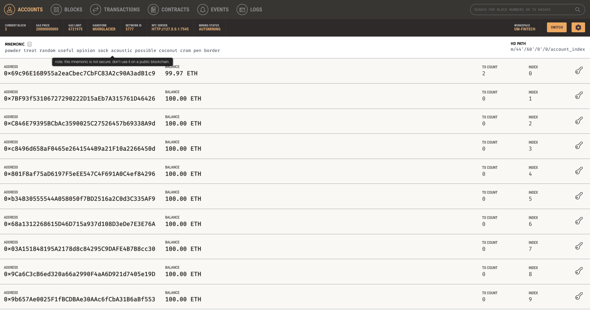
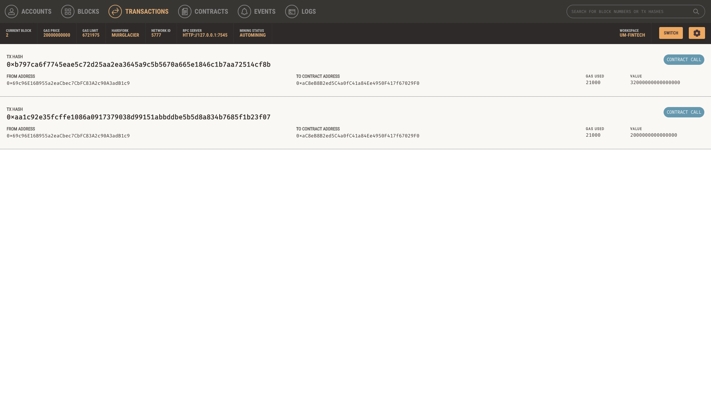

# 19-Blockchain-Wallets
Cryptocurrency Wallet

## Project Background

"I work at a startup that is building a new and disruptive platform called Fintech Finder. Fintech Finder is an application that its customers can use to find fintech professionals from among a list of candidates, hire them, and pay them. As Fintech Finder’s lead developer, I have been tasked with integrating the Ethereum blockchain network into the application in order to enable your customers to instantly pay the fintech professionals whom they hire with cryptocurrency.
In this Challenge, you will complete the code that enables your customers to send cryptocurrency payments to fintech professionals. To develop the code and test it out, I will assume the perspective of a Fintech Finder customer who is using the application to find a fintech professional and pay them for their work."

## Project Overview

This project uses "Genache" from "Truffle suite" for testing Ethereum transactional code. Genache allow you to "Quickly fire up a personal Ethereum blockchain which you can use to run tests, execute commands, and inspect state while controlling how the chain operates."

This project also uses Streamlit to run the Python files that my code was written in. "Streamlit turns data scripts into shareable web apps in minutes.
All in pure Python. No front‑end experience required."

## Imports and Installs
* import os
* import requests
* from dotenv import load_dotenv
* load_dotenv()
* from bip44 import Wallet
* from web3 import Account
* from web3 import middleware
* from web3.gas_strategies.time_based import medium_gas_price_strategy
* import streamlit as st
* from dataclasses import dataclass
* from typing import Any, List
* from web3 import Web3
* Genache

## Images

## Resources

* https://trufflesuite.com/ganache/
* https://streamlit.io/